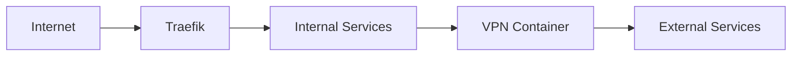

# DeLoContainers

A centralized repository for managing Docker containers and infrastructure for the DeLoNET home network.

## 🏗️ Repository Structure

```
/
├── docker-compose.yml     # Main compose file
├── mise.toml             # Task definitions
├── .env                  # Environment variables
├── stacks/              # Service stacks
│   ├── proxy/           # Traefik and networking
│   ├── media/           # Media services
│   └── ai/              # AI services
├── scripts/             # Management scripts
│   ├── health_check.sh  # Service health monitoring
│   ├── network_check.sh # Network diagnostics
│   ├── backup.sh        # Backup automation
│   ├── prune.sh         # System maintenance
│   ├── init_stack.sh    # Stack initialization
│   ├── traefik.sh       # Traefik management
│   └── vpn.sh           # VPN management
└── backups/             # Service backups
```

## 🚀 Quick Start

1. Clone the repository:
   ```bash
   git clone https://github.com/delorenj/DeLoContainers.git
   cd DeLoContainers
   ```

2. Set up environment variables:
   ```bash
   cp .env.example .env
   # Edit .env with your configuration
   ```

3. Initialize mise tasks:
   ```bash
   mise install
   ```

4. Start the base infrastructure:
   ```bash
   mise run up proxy
   ```

## 🛠️ Management Tasks

### System Health
```bash
# Check all services
mise run check

# Check specific service
mise run check prowlarr
```

### Network Diagnostics
```bash
# Check network status
mise run network

# Monitor VPN connection
mise run vpn status
```

### Service Management
```bash
# Start services
mise run up [stack_name]

# Stop services
mise run down [stack_name]

# View logs
mise run logs [service_name]

# Restart services
mise run restart [service_name]
```

### Maintenance
```bash
# Backup services
mise run backup [service_name]

# Clean up Docker resources
mise run prune

# Update services
mise run update [service_name]
```

### Stack Management
```bash
# Initialize new stack
mise run init <stack_name> <stack_type>

# Available stack types:
# - media
# - ai
# - proxy
```

### Traefik Management
```bash
# Add new domain
mise run traefik add domain.delo.sh

# Show configuration
mise run traefik show

# Check certificates
mise run traefik certs
```

### VPN Management
```bash
# Check VPN status
mise run vpn status

# Restart VPN connection
mise run vpn restart

# Test torrent connectivity
mise run vpn test
```

## 🌐 Network Architecture

The DeLoNET infrastructure uses Traefik as a reverse proxy to route traffic to various services. All traffic is routed through a VPN container (gluetun) for enhanced privacy and security.

### Domain Structure
- `*.delo.sh` - Main domain for all services
- Subdomains:
  - `index.delo.sh` - Prowlarr interface
  - `get.delo.sh` - qBittorrent interface
  - Additional services use their respective subdomains

### Network Flow


## 📦 Current Services

### Media Stack
- Prowlarr (Indexer)
- qBittorrent (Download Client)

### Proxy Stack
- Traefik (Reverse Proxy)
- Gluetun (VPN Container)

### AI Stack
- bolt.diy (Local AI Development)

## 🔧 Maintenance

### Backups
- Automatic backups are stored in `/backups`
- Retention: Last 5 backups per service
- Backup includes:
  - Service configurations
  - Databases
  - Custom settings

### System Cleanup
- Automated cleanup runs via `mise run prune`
- Removes:
  - Unused containers
  - Dangling images
  - Unused volumes and networks
  - Old images (>7 days)

## 📚 Development

### Adding New Services
1. Initialize stack:
   ```bash
   mise run init myservice media
   ```

2. Configure environment:
   ```bash
   cd stacks/media/myservice
   cp .env.example .env
   ```

3. Update configuration in `config/` directory

4. Start service:
   ```bash
   mise run up myservice
   ```

### Git Management
- Main branches: `main`, `develop`
- Feature branches: `feature/*`
- Stack branches: `stack/*`
- AI development: Uses submodule in `stacks/ai/bolt.diy`

## 📖 Additional Documentation

Detailed documentation for specific components can be found in their respective directories:
- [Proxy Stack Documentation](stacks/proxy/README.md)
- [Media Stack Documentation](stacks/media/README.md)
- [AI Stack Documentation](stacks/ai/README.md)

## 🤝 Contributing

1. Fork the repository
2. Create your feature branch
3. Commit your changes
4. Push to the branch
5. Create a Pull Request

## 📝 License

This project is licensed under the MIT License - see the [LICENSE](LICENSE) file for details.