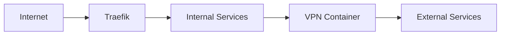

# DeLoContainers

A centralized repository for managing Docker containers and infrastructure for the DeLoNET home network.

## 🏗️ Repository Structure

```
/
├── docker-compose.yml     # Main compose file (network definitions)
├── mise.toml             # Task definitions
├── .env                  # Environment variables
├── stacks/              # Service stacks
│   ├── proxy/           # Traefik and networking
│   ├── media/           # Media services
│   └── ai/              # AI services
├── scripts/             # Management scripts
│   ├── backup.sh        # Backup automation
│   ├── init-stack.sh    # Stack initialization
│   ├── traefik.sh      # Traefik management
│   ├── vpn.sh          # VPN management
│   └── prune.sh        # System maintenance
└── backups/             # Service backups
```

## 🚀 Quick Start

1. Clone the repository:
   ```bash
   git clone https://github.com/delorenj/DeLoContainers.git
   cd DeLoContainers
   ```

2. Set up environment variables:
   ```bash
   cp .env.example .env
   # Edit .env with your configuration
   ```

3. Start a stack:
   ```bash
   mise run stack up proxy
   ```

## 🛠️ Available Tasks

### Stack Management
```bash
# Start a stack
mise run stack up <stack_name>

# Stop a stack
mise run stack down <stack_name>

# Restart a stack
mise run stack restart <stack_name>

# View stack logs
mise run stack logs <stack_name>

# Examples:
mise run stack up proxy      # Start proxy stack
mise run stack logs media    # View media stack logs
mise run stack restart ai    # Restart AI stack
```

### Backup Management
```bash
# Backup all services
mise run backup

# Backup specific service
mise run backup prowlarr
mise run backup qbittorrent
mise run backup traefik
```

### Traefik Management
```bash
# Show Traefik configuration and routes
mise run traefik show

# Check Traefik status
mise run traefik status

# Available in traefik.sh:
mise run traefik validate    # Validate configuration
mise run traefik add        # Add new domain
mise run traefik remove     # Remove domain
mise run traefik apply      # Apply changes
mise run traefik logs       # View logs
mise run traefik certs      # Check SSL certificates
```

## 🌐 Network Architecture

The DeLoNET infrastructure uses Traefik as a reverse proxy to route traffic to various services. All traffic is routed through a VPN container (gluetun) for enhanced privacy and security.

### Domain Structure
- `*.delo.sh` - Main domain for all services
- Subdomains:
  - `traefik.delo.sh` - Traefik Dashboard
  - `index.delo.sh` - Prowlarr interface
  - `get.delo.sh` - qBittorrent interface
  - Additional services use their respective subdomains

### Network Flow


## 📦 Current Services

### Media Stack
- Prowlarr (Indexer)
- qBittorrent (Download Client)

### Proxy Stack
- Traefik (Reverse Proxy)
- Gluetun (VPN Container)

### AI Stack
- bolt.diy (Local AI Development)

## 🔧 Maintenance

### Backups
- Automatic backups are stored in `/backups`
- Retention: Last 5 backups per service
- Backup includes:
  - Service configurations
  - Databases
  - Custom settings

### System Cleanup
- Use the prune script:
  ```bash
  mise run prune
  ```
- Removes:
  - Unused containers
  - Dangling images
  - Unused volumes and networks
  - Old images (>7 days)

## 📚 Development

### Adding New Services
1. Create stack directory:
   ```bash
   mkdir -p stacks/<stack_type>/<service_name>
   ```

2. Configure environment:
   ```bash
   cd stacks/<stack_type>/<service_name>
   touch docker-compose.yml .env
   ```

3. Start service:
   ```bash
   mise run stack up <service_name>
   ```

### Git Management
- Main branches: `main`, `develop`
- Feature branches: `feature/*`
- Stack branches: `stack/*`
- AI development: Uses submodule in `stacks/ai/bolt.diy`

## 📖 Additional Documentation

Detailed documentation for specific components can be found in their respective directories:
- [Proxy Stack Documentation](stacks/proxy/README.md)
- [Media Stack Documentation](stacks/media/README.md)
- [AI Stack Documentation](stacks/ai/README.md)

## 🤝 Contributing

1. Fork the repository
2. Create your feature branch
3. Commit your changes
4. Push to the branch
5. Create a Pull Request

## 📝 License

This project is licensed under the MIT License - see the [LICENSE](LICENSE) file for details.