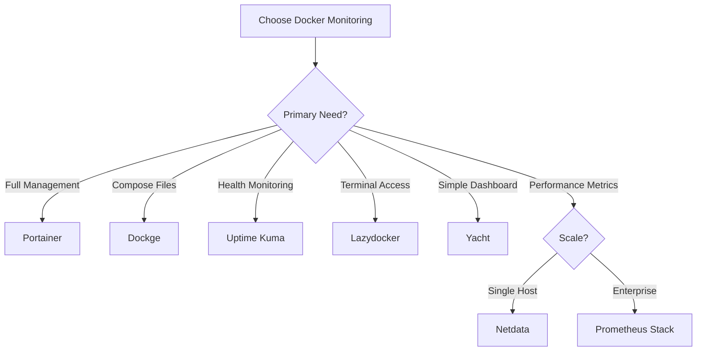

# Docker Container Monitoring Solutions Comparison

## Executive Summary

Based on comprehensive research, here are the best self-hosted solutions for monitoring Docker containers, tracking their status (running/stopped/exited), and viewing health metrics.

## Quick Recommendations

### By Use Case

| Use Case | Best Solution | Why |
|----------|--------------|-----|
| **Complete Management** | Portainer CE | Most comprehensive features, mature platform |
| **Docker Compose Focus** | Dockge | Clean interface, reactive UI, file-based |
| **Health Monitoring** | Uptime Kuma | Excellent alerting, 90+ notification services |
| **Terminal Users** | Lazydocker | Fast, keyboard-driven, SSH-friendly |
| **Simple Dashboard** | Yacht | Template-based, beginner-friendly |
| **Real-time Metrics** | Netdata | Per-second monitoring, auto-discovery |
| **Enterprise Stack** | Prometheus + Grafana | Industry standard, highly customizable |

## Detailed Tool Comparison

### 1. **Portainer** - The Established Leader
```yaml
Resource Usage: 100-200MB RAM
Setup Complexity: Low
UI Quality: ⭐⭐⭐⭐⭐
```

**Pros:**
- Complete container lifecycle management
- Supports Docker, Swarm, Kubernetes
- Role-based access control
- Template library for quick deployments
- Excellent container status visibility
- Built-in health checks and logs viewer
- Multi-host management

**Cons:**
- Business edition nags in CE version
- Can be overkill for simple setups
- Higher resource usage than alternatives

**Best For:** Production environments, teams, multi-host setups

### 2. **Dockge** - The Rising Star
```yaml
Resource Usage: 50MB RAM
Setup Complexity: Very Low
UI Quality: ⭐⭐⭐⭐⭐
```

**Pros:**
- Reactive, single-page interface
- File-based (doesn't hijack compose files)
- Interactive compose editor
- Convert docker run to compose
- Web-based terminal
- Multi-agent support
- Created by Uptime Kuma developer

**Cons:**
- Docker Compose only (no single containers)
- No volume management UI
- Newer, less mature
- Limited to compose workflows

**Best For:** Docker Compose users, home labs, simplicity seekers

### 3. **Uptime Kuma** - Health Monitoring Specialist
```yaml
Resource Usage: 50MB RAM
Setup Complexity: Very Low
UI Quality: ⭐⭐⭐⭐⭐
```

**Pros:**
- Beautiful, modern UI
- 90+ notification services
- Docker container monitoring support
- HTTP/TCP/DNS monitoring
- Status pages
- Maintenance windows
- 2FA support

**Cons:**
- Focused on uptime, not management
- Requires docker.sock mount
- No container control features
- Limited to health/status monitoring

**Best For:** Service health monitoring, alerting, status pages

### 4. **Lazydocker** - Terminal Power User
```yaml
Resource Usage: 20MB RAM
Setup Complexity: Very Low
UI Quality: ⭐⭐⭐⭐ (Terminal)
```

**Pros:**
- Extremely fast and lightweight
- All info in one terminal window
- Keyboard shortcuts for everything
- Works over SSH
- Container logs, stats, configs
- Docker and docker-compose support

**Cons:**
- Terminal only (no web UI)
- Learning curve for keybindings
- No multi-host support
- Limited to local Docker daemon

**Best For:** Developers, SSH users, terminal enthusiasts

### 5. **Yacht** - Simple & Beautiful
```yaml
Resource Usage: 80MB RAM
Setup Complexity: Low
UI Quality: ⭐⭐⭐⭐
```

**Pros:**
- Clean, modern interface
- Template marketplace
- One-click app deployment
- CPU/Memory on dashboard
- Simple container management
- Easy updates with Watchtower

**Cons:**
- Less features than Portainer
- Smaller community
- Limited advanced features
- Basic monitoring only

**Best For:** Beginners, home servers, simple deployments

### 6. **Netdata** - Real-time Performance
```yaml
Resource Usage: 50-100MB RAM
Setup Complexity: Low
UI Quality: ⭐⭐⭐⭐⭐
```

**Pros:**
- Per-second metrics
- Auto-discovers containers
- Zero configuration
- Beautiful dashboards
- Container-specific metrics
- Alerting capabilities

**Cons:**
- Performance focus, not management
- Can generate lots of data
- No container control
- Overwhelming for simple needs

**Best For:** Performance monitoring, troubleshooting, metrics

## Monitoring Stack Comparison

### Prometheus + Grafana + cAdvisor
```yaml
Resource Usage: 300-500MB RAM
Setup Complexity: High
Customization: ⭐⭐⭐⭐⭐
```

**Components:**
- **Prometheus**: Time-series database
- **Grafana**: Visualization
- **cAdvisor**: Container metrics
- **Node Exporter**: Host metrics

**Best For:** Enterprise, custom dashboards, long-term storage

### TIG Stack (Telegraf + InfluxDB + Grafana)
```yaml
Resource Usage: 200-400MB RAM
Setup Complexity: Medium
Real-time: ⭐⭐⭐⭐⭐
```

**Best For:** IoT, time-series data, real-time monitoring

### ELK Stack (Elasticsearch + Logstash + Kibana)
```yaml
Resource Usage: 1-2GB RAM
Setup Complexity: Very High
Log Analysis: ⭐⭐⭐⭐⭐
```

**Best For:** Log aggregation, compliance, forensics

## Installation Quick Start

### Portainer
```bash
docker run -d \
  -p 9000:9000 \
  -v /var/run/docker.sock:/var/run/docker.sock \
  -v portainer_data:/data \
  --restart=always \
  --name portainer \
  portainer/portainer-ce:latest
```

### Dockge
```bash
docker run -d \
  --name dockge \
  -p 5001:5001 \
  -v /var/run/docker.sock:/var/run/docker.sock \
  -v ./data:/app/data \
  -v /opt/stacks:/opt/stacks \
  --restart unless-stopped \
  louislam/dockge:1
```

### Uptime Kuma
```bash
docker run -d \
  --name uptime-kuma \
  -p 3001:3001 \
  -v uptime-kuma:/app/data \
  -v /var/run/docker.sock:/var/run/docker.sock \
  --restart=always \
  louislam/uptime-kuma:1
```

### Lazydocker
```bash
# Install locally
curl https://raw.githubusercontent.com/jesseduffield/lazydocker/master/scripts/install_update_linux.sh | bash

# Or run in Docker
docker run --rm -it \
  -v /var/run/docker.sock:/var/run/docker.sock \
  -v ~/.config/lazydocker:/.config/jesseduffield/lazydocker \
  lazyteam/lazydocker
```

### Yacht
```bash
docker run -d \
  --name yacht \
  -p 8000:8000 \
  -v /var/run/docker.sock:/var/run/docker.sock \
  -v yacht:/config \
  --restart unless-stopped \
  selfhostedpro/yacht
```

## Feature Matrix

| Feature | Portainer | Dockge | Uptime Kuma | Lazydocker | Yacht | Netdata |
|---------|-----------|---------|-------------|------------|--------|----------|
| **Container Status** | ✅ | ✅ | ✅ | ✅ | ✅ | ✅ |
| **Health Checks** | ✅ | ✅ | ✅ | ✅ | ✅ | ✅ |
| **Container Control** | ✅ | ✅ | ❌ | ✅ | ✅ | ❌ |
| **Log Viewing** | ✅ | ✅ | ❌ | ✅ | ✅ | ✅ |
| **Resource Metrics** | ✅ | ✅ | ❌ | ✅ | ✅ | ✅ |
| **Multi-Host** | ✅ | ✅ | ❌ | ❌ | ❌ | ✅ |
| **Alerting** | ✅ | ❌ | ✅ | ❌ | ❌ | ✅ |
| **Web UI** | ✅ | ✅ | ✅ | ❌ | ✅ | ✅ |
| **Terminal UI** | ❌ | ✅ | ❌ | ✅ | ❌ | ❌ |
| **Templates** | ✅ | ❌ | ❌ | ❌ | ✅ | ❌ |
| **Compose Support** | ✅ | ✅ | ❌ | ✅ | ✅ | ❌ |
| **API** | ✅ | ✅ | ✅ | ❌ | ✅ | ✅ |

## Decision Tree



## Recommended Stack for Complete Visibility

For comprehensive container monitoring combining status, health, and metrics:

### Option 1: Lightweight Stack
- **Dockge** for container management
- **Uptime Kuma** for health monitoring
- **Netdata** for performance metrics

### Option 2: Enterprise Stack
- **Portainer** for management
- **Prometheus + Grafana** for metrics
- **ELK** for log aggregation

### Option 3: Minimal Stack
- **Lazydocker** for management (terminal)
- **Uptime Kuma** for monitoring
- **Your existing monitoring** (keep current setup)

## Implementation Priority

1. **Start with**: Portainer or Dockge (management base)
2. **Add**: Uptime Kuma (health monitoring)
3. **Enhance with**: Netdata or Prometheus (metrics)
4. **Consider**: Specialized tools based on needs

## Current Setup Integration

Looking at your existing infrastructure:
- You have **Prometheus + Grafana + cAdvisor** already running
- **Traefik** for reverse proxy
- Multiple container stacks

### Recommended Additions:
1. **Dockge** - For easier compose management (lightweight, won't conflict)
2. **Uptime Kuma** - For health monitoring and alerting (you're missing this)
3. Keep your existing monitoring stack (it's already comprehensive)

## Conclusion

Based on your needs for visibility into container status and health:
- **If you want everything in one place**: Install Portainer
- **If you prefer lightweight tools**: Use Dockge + Uptime Kuma
- **If you're terminal-focused**: Lazydocker is unbeatable
- **You already have**: Good metrics with Prometheus/Grafana

The beauty is these tools can coexist - you can run Dockge for compose management, Uptime Kuma for health checks, and keep your existing monitoring stack for metrics.