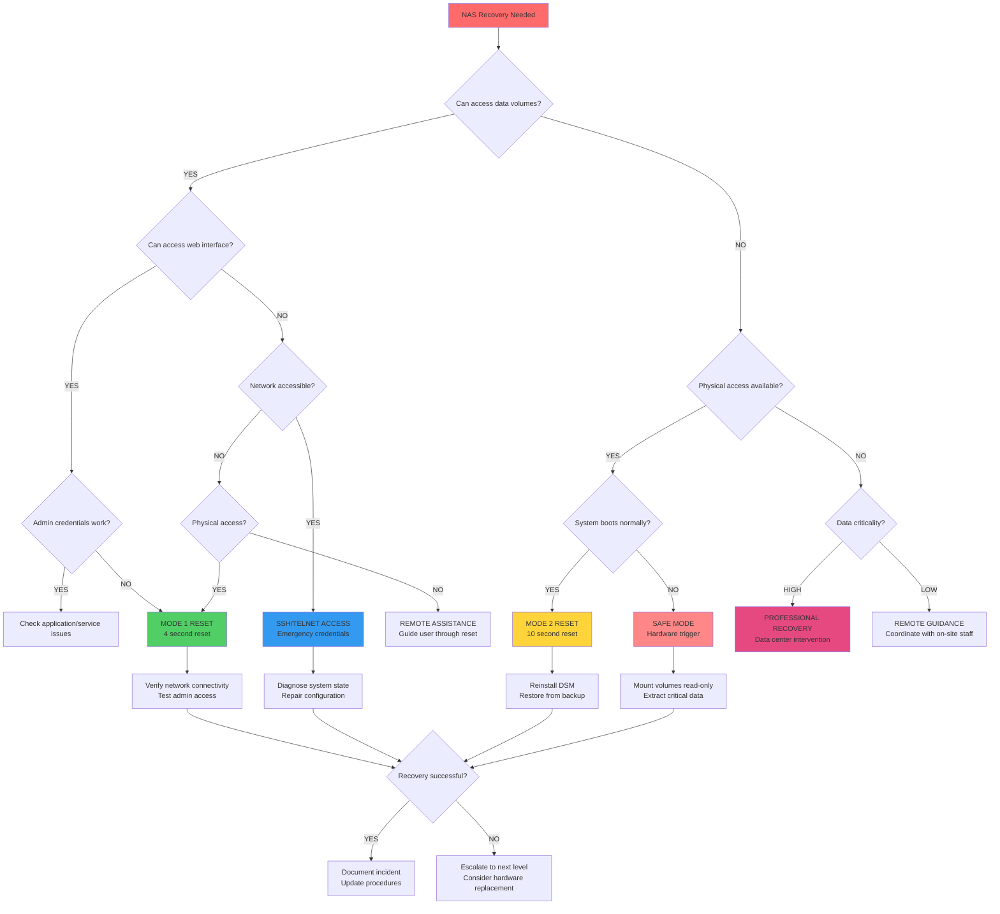

# Synology Recovery Decision Tree

## Visual Decision Flowchart



## Recovery Method Selection Matrix

### Based on Access Level

| Data Access | Network Access | Physical Access | Recommended Method | Risk Level | Duration |
|-------------|----------------|-----------------|-------------------|------------|----------|
| ✅ | ✅ | ✅ | Mode 1 Reset | 🟢 Low | 5-10 min |
| ✅ | ✅ | ❌ | SSH Emergency | 🟡 Medium | 15-30 min |
| ✅ | ❌ | ✅ | Mode 1 Reset | 🟢 Low | 10-15 min |
| ✅ | ❌ | ❌ | Remote Assistance | 🟡 Medium | 30-60 min |
| ❌ | ✅ | ✅ | Mode 2 Reset | 🟡 Medium | 30-60 min |
| ❌ | ✅ | ❌ | SSH Diagnostic | 🟠 High | 45-90 min |
| ❌ | ❌ | ✅ | Safe Mode | 🟠 High | 1-2 hours |
| ❌ | ❌ | ❌ | Professional Recovery | 🔴 Critical | 4-24 hours |

### Based on Failure Type

| Failure Type | Symptoms | Primary Method | Secondary Method | Data Risk |
|--------------|----------|----------------|------------------|-----------|
| **Admin Lockout** | Can't login, forgot password | Mode 1 Reset | SSH Password Reset | None |
| **Network Misconfiguration** | No web access, wrong IP | Mode 1 Reset | Physical reconfiguration | None |
| **DSM Corruption** | Boot loops, service failures | Mode 2 Reset | Safe Mode Recovery | Low |
| **Hardware Issues** | No boot, disk errors | Safe Mode | Professional Recovery | High |
| **Complete Failure** | No response, no LEDs | Hardware Replacement | Data Recovery Service | Critical |

## Time-Critical Decision Points

### Emergency Response (< 15 minutes)
```
IMMEDIATE ACTION REQUIRED
├─ Production data inaccessible
├─ Revenue-impacting service down
└─ Security breach suspected

DECISION PATH:
1. Physical access? → Mode 1 Reset
2. No physical access? → SSH Emergency
3. No network access? → On-site dispatch
```

### Urgent Response (15-60 minutes)
```
BUSINESS IMPACT MODERATE
├─ Non-critical services affected
├─ Backup systems available
└─ Scheduled maintenance possible

DECISION PATH:
1. Assess data integrity first
2. Choose least disruptive method
3. Plan rollback procedures
```

### Standard Response (1+ hours)
```
PLANNED MAINTENANCE WINDOW
├─ Full diagnostic capability
├─ Comprehensive testing time
└─ Complete documentation

DECISION PATH:
1. Full system analysis
2. Root cause investigation
3. Preventive measures implementation
```

## Skill Level Requirements

### Level 1: Basic User
**Capabilities:**
- Mode 1 Reset execution
- Synology Assistant usage
- Basic network configuration

**Recommended Actions:**
- 4-second reset procedure
- Contact support for guidance
- Document symptoms clearly

### Level 2: IT Administrator
**Capabilities:**
- SSH/Telnet access
- Network troubleshooting
- Service management

**Recommended Actions:**
- Emergency SSH access
- Network diagnostic tools
- Service restart procedures

### Level 3: Infrastructure Specialist
**Capabilities:**
- Safe mode operations
- Serial console access
- Hardware diagnostics

**Recommended Actions:**
- Safe mode recovery
- Hardware troubleshooting
- System rebuild procedures

### Level 4: Data Recovery Expert
**Capabilities:**
- Low-level disk access
- File system repair
- Hardware replacement

**Recommended Actions:**
- Professional recovery tools
- Clean room operations
- Forensic data extraction

## Risk Assessment Framework

### Data Integrity Risk
```
🟢 GREEN (Safe)
- Configuration-only changes
- Reversible operations
- No data modification

🟡 YELLOW (Caution)
- System state changes
- Service interruption
- Minimal data risk

🟠 ORANGE (Warning)
- File system operations
- Potential data loss
- Backup verification required

🔴 RED (Danger)
- Hardware failure suspected
- Data corruption possible
- Professional assistance recommended
```

### Business Impact Assessment
```
CRITICAL (P1)
- Production data unavailable
- Revenue loss > $1000/hour
- Customer-facing services down

HIGH (P2)
- Internal services affected
- Productivity impact significant
- Backup systems strained

MEDIUM (P3)
- Non-essential services
- Workarounds available
- Delayed maintenance acceptable

LOW (P4)
- Development/testing systems
- No business impact
- Convenient maintenance timing
```

## Communication Templates

### Initial Assessment
```
INCIDENT: [Brief Description]
TIME: [Timestamp]
IMPACT: [Business Impact Level]
ACCESS: [Available Access Methods]
NEXT STEPS: [Planned Recovery Method]
ETA: [Estimated Resolution Time]
```

### Status Updates
```
UPDATE #[Number] - [Timestamp]
STATUS: [Current State]
PROGRESS: [Actions Completed]
ISSUES: [Obstacles Encountered]
NEXT: [Immediate Next Steps]
ETA: [Revised Timeline]
```

### Resolution Summary
```
RESOLVED: [Timestamp]
ROOT CAUSE: [Technical Explanation]
RESOLUTION: [Method Used]
DURATION: [Total Downtime]
PREVENTION: [Future Mitigation Steps]
LESSONS: [Process Improvements]
```

---

**Quick Reference Card**

| Emergency | Action | Command |
|-----------|--------|---------|
| 🔥 Data Loss | Stop all writes | `sudo service stop synod` |
| 🔒 Locked Out | Reset credentials | 4-second reset button |
| 🌐 No Network | Reset network | Mode 1 reset |
| 💾 Disk Error | Read-only mount | `mount -o ro /dev/md2` |
| 🚨 System Down | Boot diagnostic | Safe mode trigger |

**Emergency Contacts**: Keep this information readily accessible during incidents.